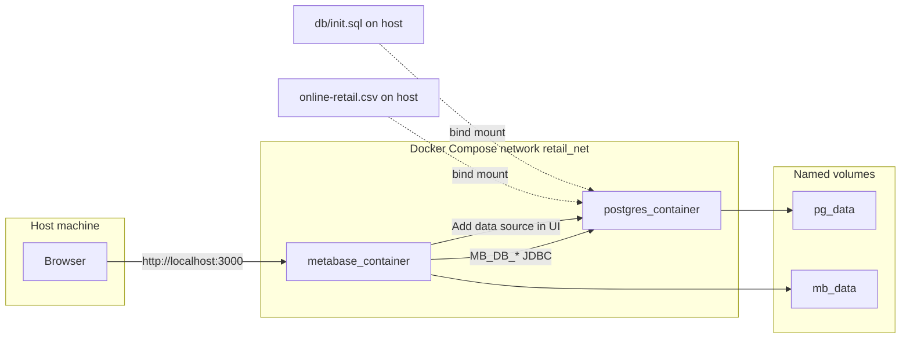
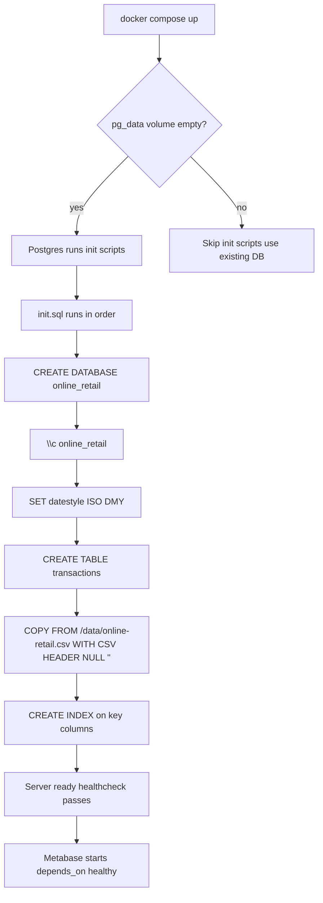

# Online Retail: PostgreSQL + Metabase (Docker Compose)

This project runs the [UCI Online Retail](https://archive.ics.uci.edu/dataset/352/online%2Bretail) transactional dataset in PostgreSQL and exposes it through [Metabase](https://www.metabase.com/) for analytics. Orchestration is defined in [`compose.yml`](compose.yml).

**Citation:** Chen, D. (2015). Online Retail [Dataset]. UCI Machine Learning Repository. [https://doi.org/10.24432/C5BW33](https://doi.org/10.24432/C5BW33).

---

## Architecture

One PostgreSQL server hosts **two logical databases**: Metabase’s application database and the analytical copy of the retail CSV.



| Component | Role |
|-----------|------|
| **postgres** (`postgres:17`) | Stores Metabase metadata in database `metabase`, and the dataset in database `online_retail`. |
| **metabase** (`metabase/metabase:latest`) | BI UI on port **3000**; uses Postgres for its own state via `MB_DB_*` environment variables. |
| **`pg_data`** | Persistent PostgreSQL data directory (survives container restarts). |
| **`mb_data`** | Persistent Metabase auxiliary data (e.g. plugins path under `/metabase-data`). |

Metabase talks to Postgres twice, for different purposes:

1. **Application database** — configured with `MB_DB_TYPE`, `MB_DB_HOST`, `MB_DB_DBNAME`, etc. Metabase stores users, saved questions, and dashboards here (database name **`metabase`**).
2. **Data source** — you register the **`online_retail`** database in the Metabase admin UI so questions and dashboards query the retail table.

---

## How the CSV is imported

Import happens **once**, when PostgreSQL initializes an **empty** data directory. The official Postgres image runs every `*.sql` script in `/docker-entrypoint-initdb.d/` using `psql` against the default database created by `POSTGRES_DB`.



**Details:**

| Step | What happens |
|------|----------------|
| **Mount** | [`data/online-retail.csv`](data/online-retail.csv) is mounted read-only at `/data/online-retail.csv` inside the Postgres container so `COPY` can read the file on the server. |
| **Script** | [`db/init.sql`](db/init.sql) is mounted as `/docker-entrypoint-initdb.d/init.sql`. |
| **Database switch** | `\c online_retail` switches the `psql` session to the new database before creating the table. |
| **Dates** | `SET datestyle = 'ISO, DMY'` parses UK-style day/month order in `InvoiceDate`. |
| **Headers** | `COPY ... WITH (FORMAT CSV, HEADER)` uses the first row as column names; table columns are quoted to match CSV headers (`InvoiceNo`, `StockCode`, …). |
| **Nulls** | `NULL ''` turns empty fields into SQL `NULL` (for example missing `CustomerID`). |
| **Indexes** | Indexes on `InvoiceNo`, `CustomerID`, `Country`, and `InvoiceDate` speed up typical Metabase filters and groupings. |

**Important:** If you need to **re-import** the CSV from scratch, remove the old database files so init runs again:

```bash
docker compose down -v
docker compose up -d
```

The `-v` flag deletes the `pg_data` volume; without it, Postgres keeps the existing cluster and **does not** re-run `init.sql`.

---

## Prerequisites

- [Docker](https://docs.docker.com/get-docker/) and Docker Compose v2
- The CSV at [`data/online-retail.csv`](data/online-retail.csv) (541,909 data rows plus header)

---

## Quick start

```bash
docker compose up -d
```

- **Metabase:** [http://localhost:3000](http://localhost:3000)
- Wait until both services are healthy (`docker compose ps`).

### Add the retail database in Metabase

After the first-run wizard:

1. **Admin** → **Databases** → **Add database**.
2. **Database type:** PostgreSQL.
3. **Name:** e.g. `Online Retail`.
4. **Host:** `postgres` (Docker DNS name on `retail_net`).
5. **Port:** `5432`.
6. **Database name:** `online_retail`.
7. **Username:** `metabase`  
8. **Password:** `metabase123` (see [`compose.yml`](compose.yml)).

The main fact table is **`public.transactions`**, with quoted column names matching the CSV (for example `"InvoiceNo"`, `"Quantity"`, `"UnitPrice"`).

### Optional: query Postgres from the host

Postgres is not published on the host by default. Use:

```bash
docker exec -it online-retail-postgres psql -U metabase -d online_retail -c 'SELECT COUNT(*) FROM transactions;'
```

---

## Default credentials (development)

These values are suitable for local development only. **Change them** before any shared or production deployment.

| Setting | Value |
|---------|--------|
| Postgres user | `metabase` |
| Postgres password | `metabase123` |
| Metabase app DB | `metabase` |
| Retail analytics DB | `online_retail` |

---

## What you can analyze

The [UCI description](https://archive.ics.uci.edu/dataset/352/online%2Bretail) positions this dataset for business analytics: sales and revenue trends, RFM-style customer segmentation, product and basket analysis, cancellations (invoice numbers starting with `C`), and geographic breakdowns by `Country`. Metabase’s question builder and SQL editor both apply.

---

## Project layout

| Path | Purpose |
|------|---------|
| [`compose.yml`](compose.yml) | Services, networks, volumes, healthchecks |
| [`db/init.sql`](db/init.sql) | Creates `online_retail`, loads CSV, creates indexes |
| [`data/online-retail.csv`](data/online-retail.csv) | Source data |
